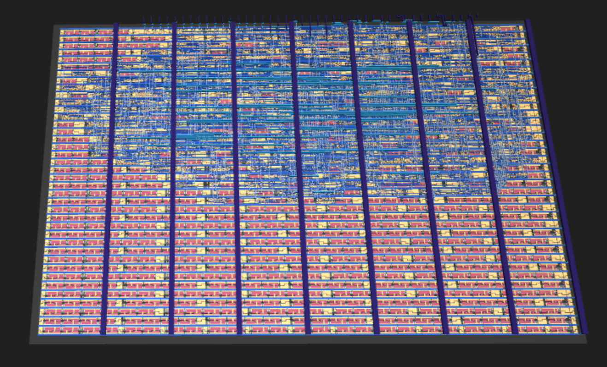
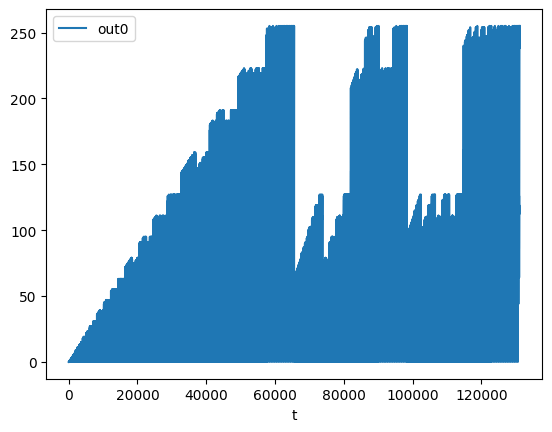

  

# tt05-bytebeat

Attempt implement the formula from one of the original [bytebeat](http://countercomplex.blogspot.com/2011/10/algorithmic-symphonies-from-one-line-of.html) [video](https://www.youtube.com/watch?v=tCRPUv8V22o) in hardware.

https://github.com/proppy/tt05-bytebeat/assets/5268/034a5684-5ad2-4742-8b40-ae75fcbcafb4

## How it works

The main module accept parameters from 4x 4-bit parameters buses and generate PCM samples according to the following formula: `((t*a)&(t>>b))|((t*c)&(t>>d))`.
Derivative of this project can easily be created by editing the formula in `src/bytebeat.x` and using the [XLS: Accelerated HW Synthesis](https://github.com/google/xls) toolkit to regenerate the Verilog code.
See the following [notebook](https://colab.research.google.com/gist/proppy/1258e007febb077c42ccea1d28e092c4/xls_audio_playground.ipynb) for more information.

## How to test

- Tweak parameters pins using a absolute encoders
- Feed the data coming from the sample bus to a DAC
